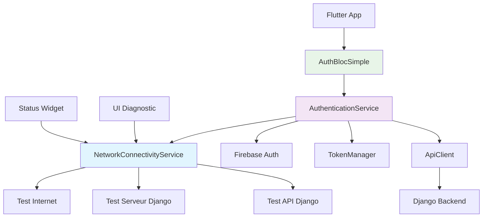

# 🔧 Résumé des Améliorations de Connectivité Flutter → Django

## 🎯 Problème Initial

- **Écran noir** au lancement de l'application
- **Erreurs d'injection** : `GetIt: Object/factory with type AuthBloc is not registered`
- **Problèmes de connectivité** potentiels entre émulateur Android et backend Django

## ✅ Solutions Implémentées

### **1. Correction du Système d'Authentification**

#### **Migration AuthBloc → AuthBlocSimple**
- ✅ Remplacement de toutes les références `AuthBloc` par `AuthBlocSimple`
- ✅ Simplification du flux d'authentification via `AuthenticationService`
- ✅ Gestion automatique des états via streams réactifs

**Fichiers modifiés :**
- `lib/main.dart`
- `lib/presentation/pages/splash/splash_page.dart`
- `lib/presentation/pages/settings/settings_page.dart`
- `lib/presentation/pages/auth/login_page.dart`

#### **Configuration d'Injection Manuelle**
- ✅ Suppression des annotations `@injectable` problématiques
- ✅ Configuration manuelle avec GetIt pour éviter les dépendances circulaires
- ✅ Injection tardive du `ApiClient` dans `TokenManager`

### **2. Améliorations de Connectivité Réseau**

#### **Configuration Android**
```xml
<!-- android/app/src/main/AndroidManifest.xml -->
<uses-permission android:name="android.permission.INTERNET" />
<uses-permission android:name="android.permission.ACCESS_NETWORK_STATE" />
<application android:usesCleartextTraffic="true">
```

#### **Service de Test de Connectivité**
- ✅ `NetworkConnectivityService` avec tests multi-niveaux :
  - Test de connectivité internet générale
  - Test d'accessibilité du serveur Django
  - Test des endpoints API Django
- ✅ Gestion intelligente des codes de réponse (401 = bon signe)
- ✅ Timeout configurables et messages d'erreur explicites

#### **Service d'Authentification Renforcé**
- ✅ Test de connectivité préalable avant authentification Firebase
- ✅ Gestion d'erreurs spécifiques pour :
  - `ConnectivityErrorType` (réseau, timeout, serveur)
  - `DioException` (requêtes HTTP)
  - `FirebaseAuthException` (authentification)
- ✅ Retry automatique et timeouts généreux

### **3. Interface Utilisateur de Diagnostic**

#### **Widget de Diagnostic Complet**
```dart
ConnectivityDiagnosticWidget()
```
- ✅ Test interactif de connectivité 3 niveaux
- ✅ Affichage détaillé des résultats
- ✅ Messages d'erreur explicites
- ✅ Uniquement visible en mode debug

#### **Widget de Statut Compact**
```dart
ConnectivityStatusWidget()
```
- ✅ Indicateur visuel de l'état du backend
- ✅ Rafraîchissement au tap
- ✅ Intégré dans splash page et login page

### **4. Gestion d'Erreurs Intelligente**

#### **Messages d'Erreur Contextuels**
```dart
switch (result.errorType) {
  case ConnectivityErrorType.noInternet:
    return 'Pas de connexion internet. Vérifiez votre réseau.';
  case ConnectivityErrorType.connectionRefused:
    return 'Impossible de se connecter au serveur. Vérifiez que le backend fonctionne.';
  case ConnectivityErrorType.timeout:
    return 'Le serveur met trop de temps à répondre. Réessayez.';
  // ...
}
```

#### **Flux d'Authentification Robuste**
```dart
// Test connectivité → Firebase Auth → Django JWT → Navigation
if (!connectivityResult.success) {
  return AuthenticationResult.failure(errorMessage);
}

final credential = await _firebaseAuth.signInWithEmailAndPassword(...)
  .timeout(const Duration(seconds: 30));
```

### **5. Backend de Test**

#### **Script Flask de Simulation**
- ✅ `test_backend_simulation.py` pour tester sans Django
- ✅ Endpoints simulés :
  - `/admin/` (page d'administration)
  - `/api/v1/discovery/` (avec authentification)
  - `/api/v1/auth/firebase-exchange/` (échange de tokens)
  - `/api/v1/health/` (santé du service)
- ✅ CORS configuré pour émulateur Android
- ✅ Réponses réalistes avec codes d'erreur appropriés

## 🚀 Architecture Finale



## 📱 Utilisation

### **1. Test de Connectivité Manual**
```bash
# Démarrer le backend de test
python test_backend_simulation.py

# Lancer Flutter
flutter run
```

### **2. Widget de Diagnostic Intégré**
- **Page de connexion** : Scroll vers le bas → Section "Debug Tools" → "Diagnostic Connectivité"
- **Splash page** : Statut compact affiché automatiquement

### **3. Logs Détaillés**
```dart
🔍 NetworkConnectivity: Début test connectivité backend...
📡 NetworkConnectivity: Test connectivité réseau générale...
✅ NetworkConnectivity: Connexion réseau OK
🖥️ NetworkConnectivity: Test accès serveur Django: http://10.0.2.2:8000
✅ NetworkConnectivity: Serveur Django accessible
🔗 NetworkConnectivity: Test endpoint API Django...
✅ NetworkConnectivity: API Django fonctionne (401 = non authentifié, normal)
📊 NetworkConnectivity: Diagnostic terminé: SUCCÈS
```

## 🎯 Tests Recommandés

### **Test 1 : Backend Accessible**
```bash
# Terminal 1: Démarrer backend test
python test_backend_simulation.py

# Terminal 2: Lancer Flutter
flutter run

# Résultat attendu: ✅ Statut "Backend OK" sur splash page
```

### **Test 2 : Backend Inaccessible**
```bash
# Pas de backend en cours d'exécution
flutter run

# Résultat attendu: ❌ Statut "Backend KO" + diagnostic détaillé
```

### **Test 3 : Diagnostic Complet**
```bash
# Dans l'app Flutter:
# 1. Aller à la page de connexion
# 2. Scroll vers le bas → Debug Tools
# 3. Cliquer "Tester" dans Diagnostic Connectivité
# 4. Voir les résultats détaillés
```

## 🔧 Configuration Backend Réel (Django)

Pour utiliser avec le vrai backend Django, suivre les instructions du guide initial :

### **1. Démarrage Serveur**
```bash
python manage.py runserver 0.0.0.0:8000
```

### **2. Configuration Pare-feu Windows**
```powershell
netsh advfirewall firewall add rule name="Python Django Server" dir=in action=allow protocol=TCP localport=8000
```

### **3. Configuration CORS Django**
```python
# settings.py
CORS_ALLOW_ALL_ORIGINS = True  # Développement uniquement
CORS_ALLOWED_ORIGINS = [
    'http://10.0.2.2:8000',
    'http://127.0.0.1:8000',
]
```

## 📊 Résultat Final Attendu

### **Logs de Connexion Réussie**
```
🔍 DEBUG: Utilisateur Firebase: user@email.com
🔑 Token Firebase récupéré: eyJhbGciOiJSUzI1NiIs...
📡 Vérification connectivité réseau...
✅ Connectivité OK, authentification Firebase...
✅ Connexion Firebase réussie
🔄 Tentative d'échange Firebase → Django JWT
✅ Échange token réussi
🚀 REQUEST: GET http://10.0.2.2:8000/api/v1/discovery/
✅ RESPONSE: 200 OK
```

### **Interface Utilisateur**
- ✅ **Splash page** : Animation + statut connectivité
- ✅ **Login page** : Formulaire + diagnostic intégré
- ✅ **Navigation automatique** selon états d'authentification
- ✅ **Messages d'erreur** contextuels et utiles

## 🎉 Avantages

1. **🔍 Debugging Facilité** : Widgets de diagnostic intégrés
2. **🛡️ Robustesse** : Gestion d'erreurs complète
3. **⚡ Performance** : Tests de connectivité rapides
4. **🎯 UX Améliorée** : Feedback utilisateur immédiat
5. **🔧 Maintenance** : Logs détaillés pour résolution de problèmes
6. **🚀 Productivité** : Backend de test inclus

---

**L'application HIVMeet dispose maintenant d'un système de connectivité robuste et d'outils de diagnostic intégrés pour résoudre rapidement tout problème de connexion !** 🚀✨ 